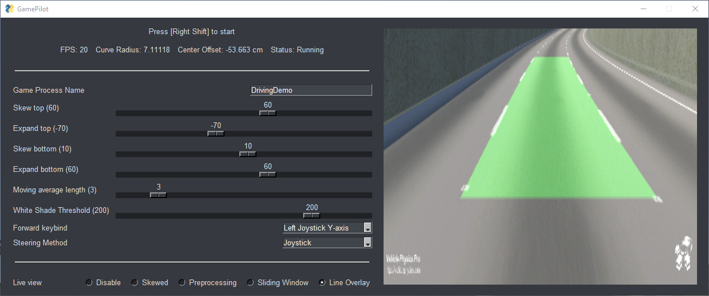
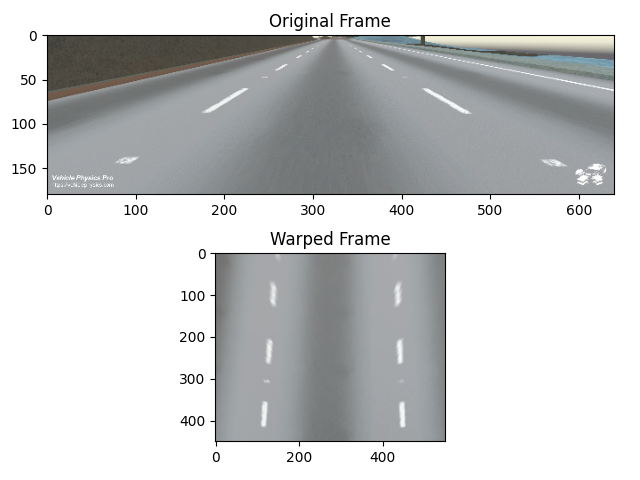
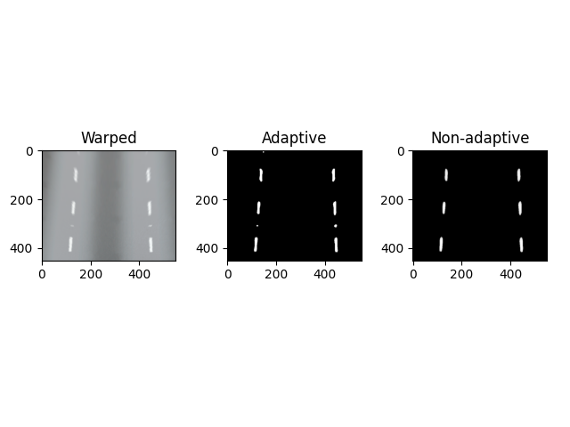
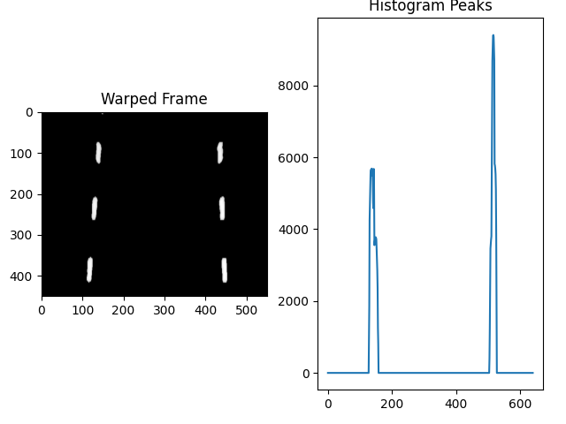
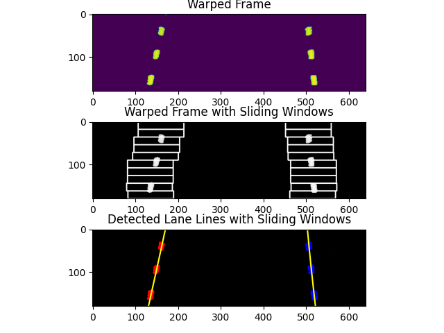
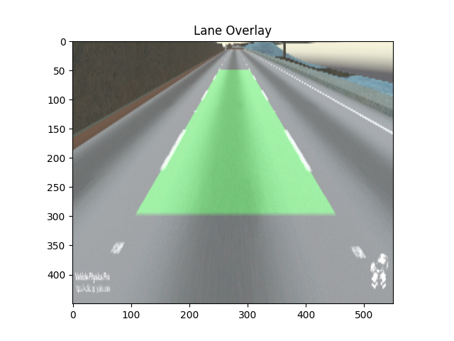

# GamePilot


### Install & Run

```
pipenv install
cd GamePilot
python gamepilot.py
```

### How to use
* You can use the DrivingDemo game provided in DrivingDemo.zip
* Run the program
* Press Right Shift to start. Make sure your game window is focussed.


### A few plots
Warping the frame:


Adaptive vs Non-adaptive preprocessing:


Histogram of lane lines in on x axis:


Sliding windows to detect lane line and curvature:


Final overlay of detected lane onto original image:

